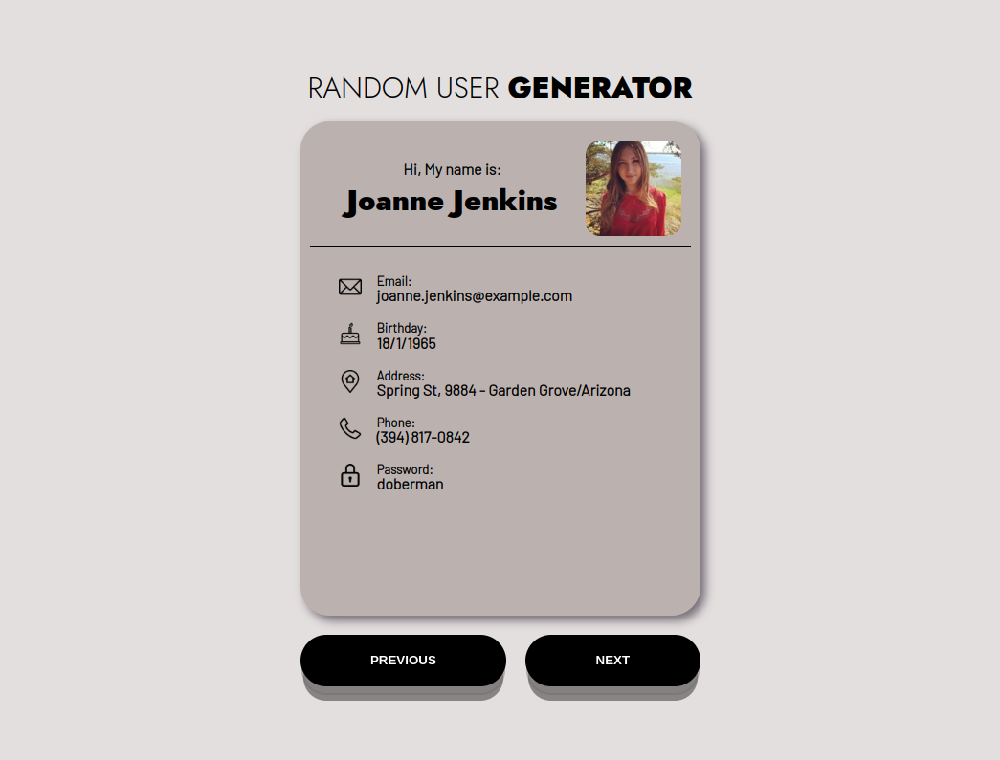

# random-user

Este é um projeto fullstack que consiste em um backend, um frontend e um banco de dados. O projeto consome dados de uma API externa e exibe os usuários em uma interface de usuário amigável.

O objetivo deste projeto é utilizar uma API externa e gratuita (https://randomuser.me/api/) para buscar informações de dados aleatórios de usuários, armazenar esses dados em um banco de dados MySQL utilizando o Sequelize ORM no backend desenvolvido em Node.js com TypeScript e Express, e exibi-los no frontend desenvolvido em React com CSS.

## 🔑 Deploy

O projeto foi implantado em um servidor de hospedagem e está disponível no seguinte endereço:

Backend: https://
Frontend: https://

## 🚀 Tecnologia

### Backend:

- ⚡ Typescript é um superconjunto sintático estrito de JavaScript e adiciona tipagem estática opcional à linguagem.

- ⚡ Node.js é um ambiente de execução JavaScript que permite executar aplicações desenvolvidas com a linguagem de forma autônoma, sem depender de um         navegador.

- ⚡ Express é um framework para aplicativo da web do Node.js mínimo e flexível que fornece um conjunto robusto de recursos para aplicativos web e móvel.

- ⚡ Sequelize é um ORM para Node.js baseado em Promises, para os bancos PostgreSQL, MySQL, MariaDB, SQLite e MS SQL Server.

- ⚡ MySQL é um sistema de gerenciamento de banco de dados, que utiliza a linguagem SQL como interface.

- ⚡ Axios é um Cliente HTTP baseado em promessas para o navegador e Node.js

- ⚡ Eslint é um linter, uma ferramenta de análise estática, para as linguagens Javascript e Typescript

- ⚡ Nodemon é um utilitário que monitora as mudanças nos arquivos do seu projeto e reinicia automaticamente o servidor Node. js quando necessário.

- ⚡ Mocha é um Framework de teste JavaScript para programas Node.js.

- ⚡ Chai é uma biblioteca de afirmação BDD/TDD para Node e para o navegador, que pode ser equiparada com qualquer framework de testes de JavaScript.

- ⚡ Sinon é uma biblioteca que fornece diversas funcionalidades (como mocks, spies e stubs) que facilitam os desenvolvimentos de testes no JavaScript.

### Frontend:

- ⚡ React é uma biblioteca front-end JavaScript de código aberto com foco em criar interfaces de usuário em páginas web.

- ⚡ CSS é um mecanismo para adicionar estilos a uma página web, aplicado diretamente nas tags HTML ou ficar contido dentro das tags <style>. Também é         possível, adicionar estilos adicionando um link para um arquivo CSS que contém os estilos.

## ✋🏻 Pré-requisitos

- [NPM](https://www.npmjs.com/): O NPM é um poderoso gerenciador de pacotes utilizado para administrar as bibliotecas e frameworks utilizados em uma        aplicação.

- [Node.js](https://nodejs.org/en): Software de código aberto, multiplataforma, baseado no interpretador V8 do Google e que permite a execução de códigos     JavaScript fora de um navegador web.

- [Docker](https://www.docker.com/): Software de código aberto usado para implantar aplicativos dentro de containers virtuais.

## :hammer_and_wrench: Configuração do Projeto.

1. Clone o repositório do projeto em seu ambiente local usando o seguinte comando:

- `git clone git@github.com:gemaquejr/random-user.git`

2. Instala as dependências:

- `npm install`

3. 🐳 Executar o Projeto

Na pasta app do projeto, suba o container utilizando o docker-compose.yml. Utilize o comando:

- `npm run compose:up`

Com isso, iniciará:

- o servidor backend;

- habilitará o banco de dados;

- o frontend.

4. Acesso à API

A API do backend estará disponível em http://localhost:3001/users após a execução do servidor. Você pode usar ferramentas como Insomnia, Postman ou até mesmo o navegador para acessar a API e visualizar os resultados.

5. Contribuição

Este projeto é de código aberto e aceita contribuições. Se você deseja contribuir para o projeto, sinta-se à vontade para fazer um fork e enviar um pull request com suas alterações. Certifique-se de seguir as melhores práticas de codificação, incluindo a execução de testes e a revisão do código antes de enviar as alterações.

6. Licença

Este projeto é licenciado sob a Licença MIT. Consulte o arquivo LICENSE para obter mais informações.
